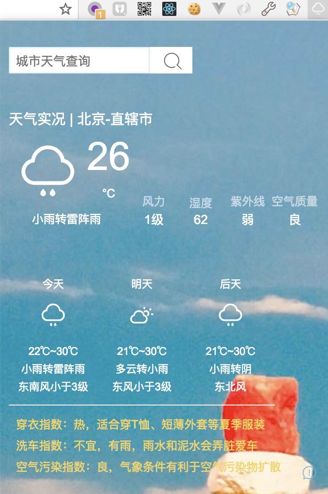
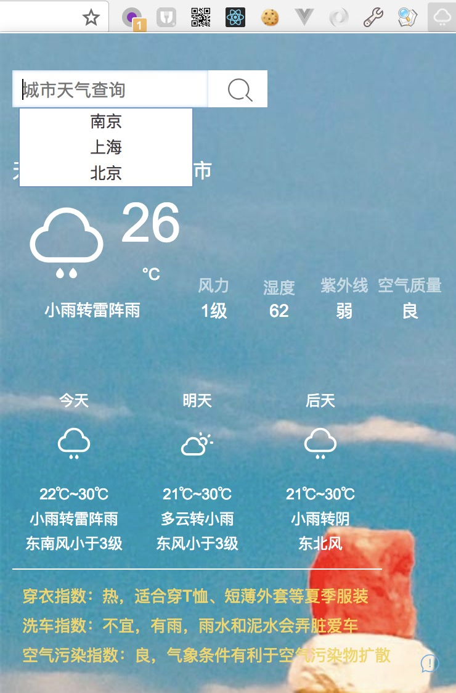

chrome插件——城市天气查询
====
> PS: 第一个练手chrome插件 >.<, 找的一个webxml的免费接口, 因为是免费的所以接口有访问次数限制，和频次限制，见谅>.<~~~

> 天使爱美丽，看天气，穿花衣，女神必备！

免费接口使用了两个：
- 查询当前所在城市接口： http://int.dpool.sina.com.cn/iplookup/iplookup.php
- 根据城市名称查询天气：http://www.webxml.com.cn/WebServices/WeatherWebService.asmx/getWeatherbyCityName

功能：
- 在浏览器打开之后自动获取当前所在城市,并查询当前所在城市天气
- 根据城市名称查询天气
- 记录最近所查城市历史记录，并给出suggestion，单击suggestion查询所点击城市

界面图片：

历史查询记录：

