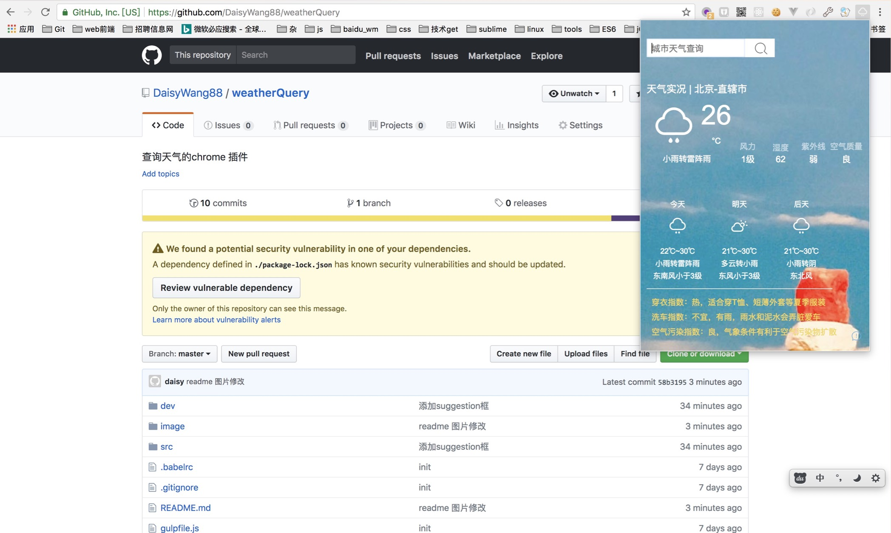

chrome插件——城市天气查询
====
使用方式：

1.通过clone 源码
- clone 代码库
- 在项目根目录 输入命令行
```npm install```
```npm run dev``` 会生成一个dist文件
- 从右上角菜单->更多工具->扩展程序可以进入插件管理页面，也可以直接在地址栏输入 chrome://extensions 访问。
- 打开右上角"开发者模式"
- 点击"加载已解压的程序"
- 选择dist文件

2. 通过加载.crx插件
- 访问chrome://extensions页面，将weather-query.crx拖入页面即可


> PS: 第一个练手chrome插件 >.<, 找的一个webxml的免费接口, 因为是免费的所以接口有访问次数限制，和频次限制，见谅>.<~~~

> 天使爱美丽，看天气，穿花衣，女神必备！


免费接口使用了两个：
- 查询当前所在城市接口： http://int.dpool.sina.com.cn/iplookup/iplookup.php
- 根据城市名称查询天气：http://www.webxml.com.cn/WebServices/WeatherWebService.asmx/getWeatherbyCityName

功能：
- 在浏览器打开之后自动获取当前所在城市,并查询当前所在城市天气
- 根据城市名称查询天气
- 记录最近所查城市历史记录，并给出suggestion，单击suggestion查询所点击城市

界面图片：



历史查询记录：


打赏：


